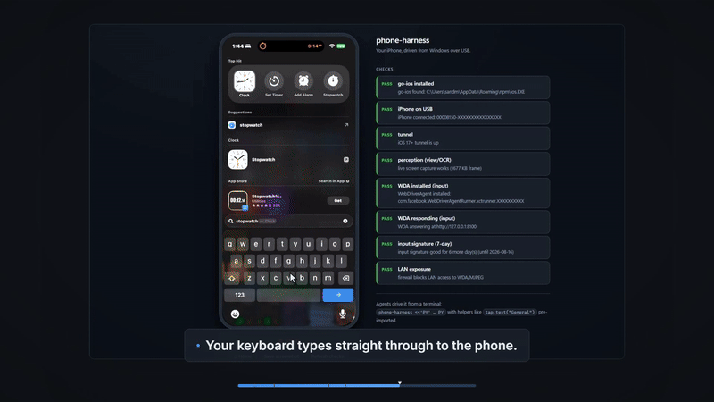

# phone-claude

**Let an LLM agent see and control a real iPhone from a Windows desktop. No Mac, no Xcode, no Appium server, no jailbreak, free Apple ID.**

[](https://github.com/ucsandman/phone-claude/actions/workflows/tests.yml)
[](LICENSE)
[](https://www.python.org/)
[](#contributing)



Every iPhone automation route assumes you own a Mac. This one does not. phone-claude drives a real iPhone over USB using [go-ios](https://github.com/danielpaulus/go-ios) and [WebDriverAgent](https://github.com/appium/WebDriverAgent), wrapped in a small Python harness an agent (or a human) can use directly.

It is a Windows rebuild of [phone-harness](https://github.com/ShawnPana/phone-harness), which relies on macOS iPhone Mirroring. Bonus over the original: WebDriverAgent exposes the real UI element tree, so the agent reads exact buttons and labels instead of OCR guesses.

```
[iPhone iOS 17+] .. WebDriverAgent app (sideloaded once, free Apple ID)
      | USB
[Windows]  go-ios (tunnel + launch + port forward)  ->  Python harness  ->  live viewer
      |
[Agent]    phone-harness <<'PY' ... PY   (helpers pre-imported)
```

## Features

- **Real UI tree, not screenshots.** `tap_text("General")` finds the actual element and taps its center. Coordinates are points, exact.
- **Live viewer in your browser** at ~34 fps: click to tap, drag to swipe, type on your keyboard, save screenshots. Works even before touch input is set up.
- **One-call flows** like `send_message("Mom", "on my way")` that open Messages, find the thread, type, and send, with guardrails (see Security).
- **A doctor that names the fix.** `phone-harness doctor` walks the whole chain and every FAIL tells you the exact command or click that repairs it, including a countdown before the 7-day free-ID signature expires.
- **Free Apple ID signing that actually works.** Sideloadly leaves the nested `.xctest` bundle unsigned, so the driver never launches. `phone-harness fix-input` repairs that locally: no Apple password scripting, no paid developer account. See [How the signing fix works](#how-the-signing-fix-works).
- **Kill switch.** A red STOP button in the viewer freezes every agent action while you keep watching the screen.

## Quick start

```bat
git clone https://github.com/ucsandman/phone-claude
cd phone-claude
pip install -r requirements.txt
python launch.py          :: brings the link up + opens the live viewer
```

First time? Follow **[docs/setup-windows.md](docs/setup-windows.md)** (about 20 minutes, one-time: USB driver, Developer Mode, sideload WebDriverAgent).

Day-to-day commands:

```bat
phone-harness doctor      :: diagnose the whole chain, each FAIL names its fix
phone-harness up          :: start tunnel + WebDriverAgent + port forwards
phone-harness view        :: live viewer (click = tap, drag = swipe, keys = type)
phone-harness fix-input   :: re-sign the input driver (free Apple ID, 7-day cycle)
phone-harness down        :: stop background processes
```

## Agent usage

Pipe Python to stdin. Helpers are pre-imported:

```bat
phone-harness <<'PY'
open_app("Settings")
wait_stable()
tap_text("General")
screenshot("general.png")
PY
```

| Helper | What it does |
|---|---|
| `screenshot(path=None)` | PNG of the screen |
| `screen_info()` | screen size in points |
| `ocr()` | all visible text with center coordinates (from the real UI tree) |
| `ui_tree()` | full raw element tree (cached ~2s; every action invalidates it) |
| `tap(x, y)` / `long_press(x, y)` | touch at points |
| `tap_text("General")` | find text and tap it |
| `type_text("hello")` | type into the focused field |
| `swipe(x1,y1,x2,y2)` / `scroll("down")` | gestures |
| `open_app("Settings")` | launch by friendly name or bundle id |
| `send_message("Mom", "hi")` | open Messages, open the thread, type, send |
| `press_home()` | home screen |
| `wait_stable()` | wait until the screen stops changing |
| `unlock()` | wake + unlock (passcode opt-in via `.env`) |

Add your own helpers in `agent-workspace/agent_helpers.py`. They auto-load into every script.

## Security and responsible use

This tool is for **your own phone, under your supervision**. The guardrails are part of the product:

- **Lock the ports.** go-ios forwards WDA (:8100) and its MJPEG stream (:9100) on `0.0.0.0`, and WebDriverAgent has no auth, so by default anyone on your Wi-Fi could drive the phone. The doctor flags this; click **Lock ports** in the viewer (or run `scripts\lock_ports.ps1`, one-time, needs admin) to add a firewall rule. Loopback keeps working.
- **Kill switch.** The red **STOP** button in the viewer (or a `.state/STOP` file) blocks every phone action at the client chokepoint until you click **RESUME**. It bounds a runaway agent. It does not defend against prompt injection.
- **Send guardrails.** `send_message` refuses to send if the contact name is ambiguous or the opened thread does not match, and logs every send to `.state/actions.log`, shown as **Recent sends** in the viewer.
- **Origin guard.** The viewer API rejects cross-origin and DNS-rebinding requests, so a random web page in another tab cannot drive your phone.
- **Passcode safety.** `unlock()` types your passcode only when the passcode pad is actually on screen, and scrubs it from error messages. The passcode itself is opt-in via `.env` and never committed.

Do not point this at a phone you do not own. Do not use it to send unsolicited messages. Automated bulk messaging will get your Apple ID or number flagged, and it makes you a bad person besides.

## How the signing fix works

Sideloading WebDriverAgent with a free Apple ID installs the app, but the test runner never starts: Sideloadly signs the host app and leaves `PlugIns/WebDriverAgentRunner.xctest` unsigned, so iOS Library Validation rejects it. `phone-harness fix-input` repairs this entirely on your machine:

1. Builds a `.p12` from Sideloadly's own cert and key (openssl, local files).
2. While Sideloadly signs, it briefly writes the freshly minted provisioning profile to `%TEMP%`. A FileSystemWatcher captures it in the few hundred milliseconds it exists.
3. Re-signs the whole IPA with go-ios `ios sign app`, which signs the nested `.xctest` with the same Team ID, then installs.

No Apple servers are contacted, no Apple password is scripted, no session tokens are reused. The 7-day free-ID expiry still applies; the doctor counts it down and one command re-signs.

## Architecture

| Module | Role |
|---|---|
| `wda_client.py` | thin HTTP client for WebDriverAgent (requests only), kill-switch chokepoint |
| `device.py` | go-ios wrapper: tunnel, runwda, port forwards, pids and logs in `.state/` |
| `capture.py` | signing-free screenshots via go-ios (perception works before input does) |
| `helpers.py` | the agent API: tap, tap_text, ocr, send_message, unlock |
| `admin.py` | doctor, up, down |
| `signing.py` | the free-Apple-ID re-signing flow |
| `viewer.py` + `viewer.html` | the human surface: live screen, remote control, doctor panel, STOP |

## Tests

Unit tests need no phone:

```bat
pip install pytest
python -m pytest tests -q
```

## Known limits

- Free Apple ID signatures expire every 7 days. Run `phone-harness fix-input` again; the doctor warns you 48 hours ahead.
- No Face ID, camera, or DRM video flows. One phone per session.
- The phone must be unlocked, or set `PHONE_PASSCODE` in `.env` and call `unlock()`.
- iOS 17+ tunnel needs wintun.dll once (admin) if userspace mode fails.

## Contributing

Issues and PRs are welcome. Ground rules:

- `python -m pytest tests -q` must pass without a phone attached.
- New agent primitives go in `helpers.py` and `__all__`.
- Keep `wda_client.py` free of go-ios knowledge and `device.py` free of HTTP knowledge.
- No new runtime dependencies beyond `requests` without a stated reason.

## Credits

- [ShawnPana/phone-harness](https://github.com/ShawnPana/phone-harness) for the original macOS concept.
- [danielpaulus/go-ios](https://github.com/danielpaulus/go-ios) for the USB transport that makes Windows possible.
- [appium/WebDriverAgent](https://github.com/appium/WebDriverAgent) for the automation driver.
- [Sideloadly](https://sideloadly.io/) for free-Apple-ID sideloading.

## License

[MIT](LICENSE)
